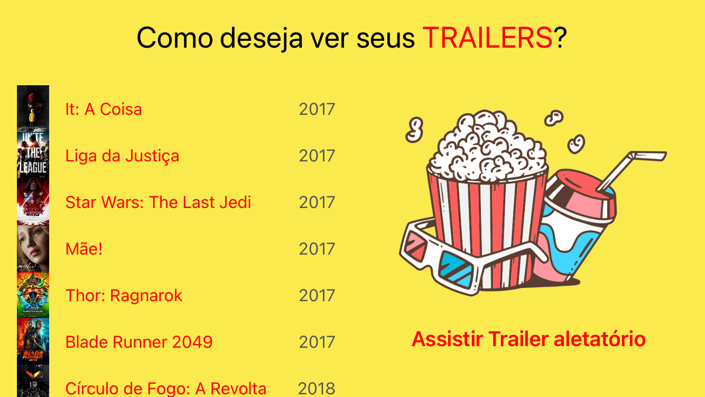

# TrailerFlix
> Aplicativo para desenvolvimento Swift/iOS

* Linguagem
    * Swift 5.5
    * MVC
    
* Auto Layout
    * Autoresizing
    * Constraint
    * Assets
    
* Components
    * UIView
    * UILabel
    * UIImage
    * UITableView
    * UITableViewCell
    * UIButton
    * AVPlayer
    * AVPlayerViewController
    * Segue
    
Recursos
    * Text Attributed
    * Content Hugging Priority
    
## Snapshots

  
 

 
  
